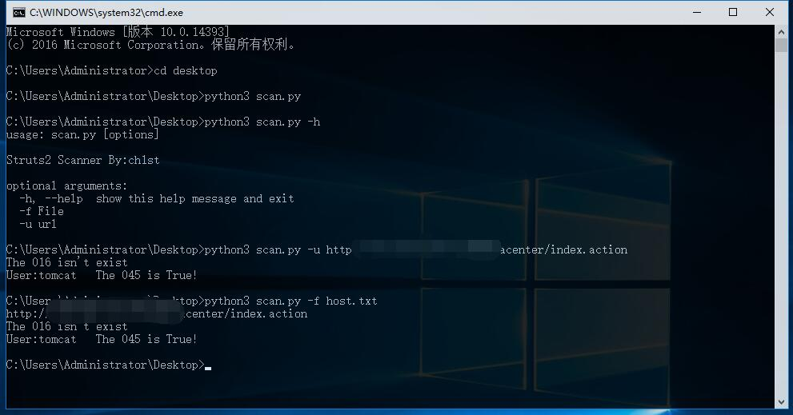

# struts2-scan
概述：
    批量扫描目标是否存在各个版本Struts2漏洞
    目前支持对s2-045,s2-016的批量检测
    基于python3.x版本开发
# requirement
    pip install requests
# Usage
    python scan.py -f hosts.txt
    Or
    python scan.py -u http://www.xxx.com/index.action
# Result
    
    
